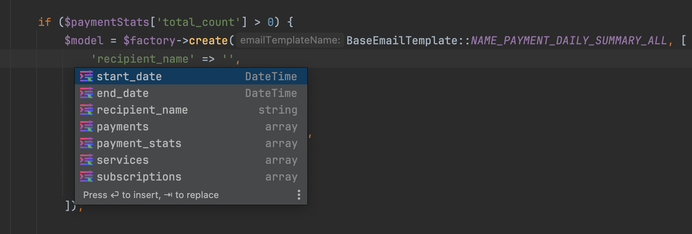

# intellij-psa
## Intellij Project-Specific Autocomplete

<!-- Plugin description -->
Small plugin which adds support for custom autocomplete & GoTo on the language you're writing your project.

<!-- Plugin description end -->

## Installation

[//]: # (- Using IDE built-in plugin system:)

[//]: # (  )
[//]: # (  <kbd>Settings/Preferences</kbd> > <kbd>Plugins</kbd> > <kbd>Marketplace</kbd> > <kbd>Search for "intellij-psa"</kbd> >)

[//]: # (  <kbd>Install Plugin</kbd>)

[//]: # (  )
- Manually:

  Download the [latest release](https://github.com/sam0delkin/intellij-psa/releases/latest) and install it manually using
  <kbd>Settings/Preferences</kbd> > <kbd>Plugins</kbd> > <kbd>⚙️</kbd> > <kbd>Install plugin from disk...</kbd>

## Supported Languages
* PHP
* JavaScript
* others - todo

## Documentation

TODO