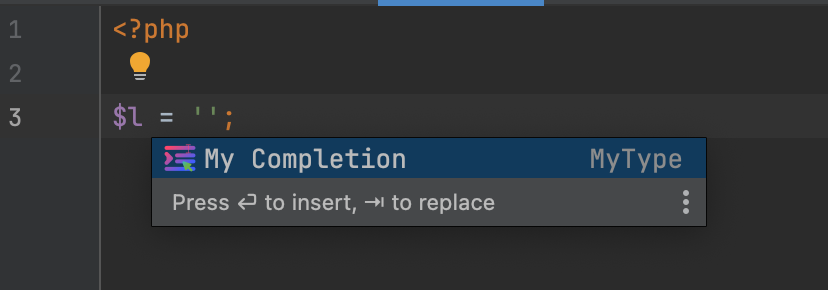
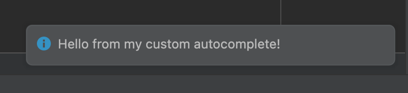

# intellij-psa
##  Intellij Project-Specific Autocomplete


[](https://plugins.jetbrains.com/plugin/24604)
[](https://plugins.jetbrains.com/plugin/24604)


<!-- Plugin description -->
Small plugin which adds support for custom autocomplete & GoTo on the language you're writing your project.

Currently, supports:
* Custom autocomplete based on your code (Ctrl + Space)
* Custom GoTo based on your code (Ctrl/Command + Click)

### Supported Languages
* PHP
* JavaScript
* TypeScript
* others - coming soon

To check how to add custom autocomplete, please read [documentation](https://github.com/sam0delkin/intellij-psa#documentation) 
<!-- Plugin description end -->


## Installation

[//]: # (- Using IDE built-in plugin system:)

[//]: # (  )
[//]: # (  <kbd>Settings/Preferences</kbd> > <kbd>Plugins</kbd> > <kbd>Marketplace</kbd> > <kbd>Search for "intellij-psa"</kbd> >)

[//]: # (  <kbd>Install Plugin</kbd>)

[//]: # (  )
- Manually:

  Download the [latest release](https://github.com/sam0delkin/intellij-psa/releases/latest) and install it manually using
  <kbd>Settings/Preferences</kbd> > <kbd>Plugins</kbd> > <kbd>⚙️</kbd> > <kbd>Install plugin from disk...</kbd>


## Idea
### Introduction

Most of scripting languages has own frameworks/CMS (like Symfony, Drupal in PHP, Nest, Next in JS/TS).
And there are some plugins to support some framework/CMS specific features, 
like [symfony plugin](https://plugins.jetbrains.com/plugin/7219-symfony-support)
 or [drupal plugin](https://plugins.jetbrains.com/plugin/7352-drupal). The main problem of
these plugins is that they are not project-specific, and you need to install a lot of plugins
for support different features. And what if you have some custom features in
your own project and want to handle references or autocomplete them?

### How it works?
First of all to use the plugin you should enable it in settings and provide a path to the **executable** script
which will be executed for completions or finding references for GoTo. 

Each time you will try to complete some expression (like ctrl + space) plugin will create a very simple representation
of the currently focused [PSI element](https://plugins.jetbrains.com/docs/intellij/psi-elements.html), JSON encode it,
write to a tmp file (caused by some limitations of arguments/ENV variable length) and pass it into the specified executable.

For example, if you try to autocomplete the following PHP code:
```php
<?php

function myFunc() {
    $l = '';
//        ^   caret is here
}

```
then you'll receive the following JSON in the filepath, passed from `PSA_CONTEXT` ENV variable:
<details>
  <summary>Expand</summary>

```JSON
{
  "elementType": "right single quote",
  "elementName": null,
  "elementFqn": null,
  "text": "'",
  "parent": {
    "elementType": "String",
    "elementName": null,
    "elementFqn": null,
    "text": "''",
    "parent": {
      "elementType": "Assignment expression",
      "elementName": null,
      "elementFqn": null,
      "text": "$l = ''",
      "parent": {
        "elementType": "Statement",
        "elementName": null,
        "elementFqn": null,
        "text": "$l = '';",
        "parent": {
          "elementType": "Group statement",
          "elementName": null,
          "elementFqn": null,
          "text": "{\n    $l = '';\n}",
          "parent": {
            "elementType": "FUNCTION",
            "elementName": null,
            "elementFqn": null,
            "text": "function myFunc() {\n    $l = '';\n}",
            "parent": {
              "elementType": "PsiElement(Non Lazy Group statement)",
              "elementName": null,
              "elementFqn": null,
              "text": "<?php\n\nfunction myFunc() {\n    $l = '';\n}",
              "parent": {
                "elementType": "php.FILE",
                "elementName": null,
                "elementFqn": null,
                "text": "<?php\n\nfunction myFunc() {\n    $l = '';\n}\n",
                "parent": {
                  "elementType": "<null>",
                  "elementName": null,
                  "elementFqn": null,
                  "text": "",
                  "parent": {
                    "elementType": "<null>",
                    "elementName": null,
                    "elementFqn": null,
                    "text": "",
                    "parent": {
                      "elementType": "<null>",
                      "elementName": null,
                      "elementFqn": null,
                      "text": "",
                      "parent": {
                        "elementType": "<null>",
                        "elementName": null,
                        "elementFqn": null,
                        "text": "",
                        "parent": {
                          "elementType": "<null>",
                          "elementName": null,
                          "elementFqn": null,
                          "text": "",
                          "parent": {
                            "elementType": "<null>",
                            "elementName": null,
                            "elementFqn": null,
                            "text": "",
                            "parent": null,
                            "prev": null,
                            "next": null
                          },
                          "prev": {
                            "elementType": "<null>",
                            "elementName": null,
                            "elementFqn": null,
                            "text": "",
                            "parent": null,
                            "prev": null,
                            "next": null
                          },
                          "next": {
                            "elementType": "<null>",
                            "elementName": null,
                            "elementFqn": null,
                            "text": "",
                            "parent": null,
                            "prev": null,
                            "next": null
                          }
                        },
                        "prev": null,
                        "next": {
                          "elementType": "PLAIN_TEXT_FILE",
                          "elementName": null,
                          "elementFqn": null,
                          "text": "",
                          "parent": null,
                          "prev": null,
                          "next": null
                        }
                      },
                      "prev": {
                        "elementType": "<null>",
                        "elementName": null,
                        "elementFqn": null,
                        "text": "",
                        "parent": null,
                        "prev": null,
                        "next": null
                      },
                      "next": {
                        "elementType": "<null>",
                        "elementName": null,
                        "elementFqn": null,
                        "text": "",
                        "parent": null,
                        "prev": null,
                        "next": null
                      }
                    },
                    "prev": {
                      "elementType": "<null>",
                      "elementName": null,
                      "elementFqn": null,
                      "text": "",
                      "parent": null,
                      "prev": null,
                      "next": null
                    },
                    "next": {
                      "elementType": "<null>",
                      "elementName": null,
                      "elementFqn": null,
                      "text": "",
                      "parent": null,
                      "prev": null,
                      "next": null
                    }
                  },
                  "prev": {
                    "elementType": "<null>",
                    "elementName": null,
                    "elementFqn": null,
                    "text": "",
                    "parent": null,
                    "prev": null,
                    "next": null
                  },
                  "next": {
                    "elementType": "<null>",
                    "elementName": null,
                    "elementFqn": null,
                    "text": "",
                    "parent": null,
                    "prev": null,
                    "next": null
                  }
                },
                "prev": null,
                "next": null
              },
              "prev": {
                "elementType": "WHITE_SPACE",
                "elementName": null,
                "elementFqn": null,
                "text": "\n",
                "parent": null,
                "prev": null,
                "next": null
              },
              "next": null
            },
            "prev": null,
            "next": {
              "elementType": "WHITE_SPACE",
              "elementName": null,
              "elementFqn": null,
              "text": "\n\n",
              "parent": null,
              "prev": null,
              "next": null
            }
          },
          "prev": null,
          "next": {
            "elementType": "WHITE_SPACE",
            "elementName": null,
            "elementFqn": null,
            "text": " ",
            "parent": null,
            "prev": null,
            "next": null
          }
        },
        "prev": {
          "elementType": "WHITE_SPACE",
          "elementName": null,
          "elementFqn": null,
          "text": "\n",
          "parent": null,
          "prev": null,
          "next": null
        },
        "next": {
          "elementType": "WHITE_SPACE",
          "elementName": null,
          "elementFqn": null,
          "text": "\n    ",
          "parent": null,
          "prev": null,
          "next": null
        }
      },
      "prev": {
        "elementType": "semicolon",
        "elementName": null,
        "elementFqn": null,
        "text": ";",
        "parent": null,
        "prev": null,
        "next": null
      },
      "next": null
    },
    "prev": null,
    "next": {
      "elementType": "WHITE_SPACE",
      "elementName": null,
      "elementFqn": null,
      "text": " ",
      "parent": null,
      "prev": null,
      "next": null
    }
  },
  "prev": null,
  "next": {
    "elementType": "left single quote",
    "elementName": null,
    "elementFqn": null,
    "text": "'",
    "parent": null,
    "prev": null,
    "next": null
  }
}
```
</details>

> [!NOTE]
> In the output above the `options` option is omitted to make output less size.

## Documentation

As it already mentioned in [introduction](#how-it-works), plugin is sending JSON-encoded PSI tree into the executable.

Here is the full list of ENV variables passed to the executable:
* `PSA_CONTEXT` - file path that contain the JSON-encoded PSI context.
* `PSA_TYPE` - may be either `Completion` or `GoTo`. Type of the execution.
* `PSA_LANGUAGE` - language which is caused the autocomplete/resolving reference (`PHP`, `JS`, ...).
* `PSA_DEBUG` - `1` in case of debug is enabled in plugin settings and `0` otherwise.

So, you can parse the JSON and analyze it for your needs. This JSON has a tree structure, and each element will have
the following structure:

<details>
  <summary>Expand</summary>

```JSON
{
  "elementType": "string",
  "elementName": "string | null",
  "elementFqn": "string | null",
  "options": {
    "optionName": "optionValue"
  },
  "text": "string",
  "parent": "additional tree element",
  "prev": "additional tree element",
  "next": "additional tree element"
}
```
</details>

By analyzing element and it's parents + some options you may find how to check that the caret is on the element
which may be autocompleted.


As a result your script should return:

* Array of completions in case of `PSA_TYPE` is `Completion`.
* Array of completions with one element (this element should contain a link) in case of `PSA_TYPE` is `GoTo`.
* Optional, you can pass notifications array which will be shown by IDEA. Useful for debug purposes.
* Optional, you can return an array of element types to filter GoTo for performance reasons. For more information, 
please read [performance](#goto-optimizations) section.

Full resulting JSON structure will be described below:

<details>
  <summary>Expand</summary>

```JSON
{
  "completions": [
    {
      "text": "string, the text of completion",
      "link": "string, required only in case of `PSA_TYPE=GoTo`, the absolute/relative link to the file in format FileName.ext[:line_number][:position]",
      "bold": "boolean, should the completion be bold.",
      "priority": "number, optional. Used for ordering elements in the autocomplete. If `bold` is `true` and `priority` is not specified, then default value would be 100.",
      "type": "string, the type which will be shown as grayed text on the right of completion."
    }
  ],
  "goto_element_filter": "optional, array of strings. Used for filter element types where GoTo will work. Performance optimization.",
  "notifications": [
    {
      "type": "string, may be either `info`, `error` or `warning`.",
      "text": "string, the text of the notification."
    }
  ]
}
```
</details>

And the full working example:

<details>
  <summary>Expand</summary>

```JSON
{
  "completions": [
    {
      "text": "My Completion",
      "link": "/path/to/file.php:123:123",
      "bold": false,
      "priority": 123,
      "type": "MyType"
    }
  ],
  "goto_element_filter":  ["single quoted string", "double quoted string"],
  "notifications": [
    {
      "type": "info",
      "text": "Hello from my custom autocomplete!"
    }
  ]
}
```
</details>

In case of your executable will respond with the JSON above, result completion will look like:



And the following notification will be shown:



For working examples on different languages, check out the [examples](examples) folder.

> [!NOTE]
> In case of `PSA_TYPE` is `GoTo`, you should return only one completion with the link to reference.

### Performance considerations

#### General

Calling external program/API is not fast by nature. Things are making worse in case of
program is need to do some long computations (like compiling TypeScript, or building some cache (like Symfony does)).

So, keep it in mind and make some long computations as the last part of your code. For example, if
you need to autocomplete Symfony services, boot Symfony kernel only in case of you sure that
completions may be applied in the current context.
<details>
  <summary>Expand</summary>

Do:
```php
<?php

$context = json_decode(file_get_contents(getenv('PSA_CONTEXT')), true);

if (!checkElement($context)) {
  echo json_encode(['completions' => [], 'notifications' => []]);

  die;
}

$kernel = bootKernel();
```
instead of:
```php
<?php

$context = json_decode(file_get_contents(getenv('PSA_CONTEXT')), true);
$kernel = bootKernel();

if (!checkElement($context)) {
  echo json_encode(['completions' => [], 'notifications' => []]);

  die;
}
```
</details>

#### GoTo optimizations

When you're clicking (Ctrl/Command + Click) by **any** element in the IDE editor, IDE is calling all GoTo
contributors, regardless of language or any other things. And there is no way to know - does your custom autocomplete
will resolve the reference or not. For this purposes, there is an additional option were added: `goto_element_filter`.
Here your script should return an array of element types to filter GoTo references. It will be saved first time your
script will be called and then will ignore all elements that are not matching the types provided.

## Ideas / ToDo

- [x] Add support of autocomplete
- [x] Add support of GoTo
- [ ] Add support of intentions
- [ ] Add support of custom code templates with variables

## FAQ / How To

**Q: What if i run my project in Docker?**

**A:** It's no problem. You can easily use it with the plugin. See examples for 
[docker-compose](examples/docker-compose) or [docker](examples/docker).

**Q: What about some API projects, like Nest/Next, which are starting slow?**

**A:** Yeah, it's problem for Nest/Next to compile each time you're trying to autocomplete the code. But there is a 
solution: you can implement some route, which will be accessible in DEV environment only, and respond with completions.
See [example](examples/api).

**Q: What is i want to use some language that is not yet supported?**

**A:** That's really great 😊. Please, [fork](https://github.com/sam0delkin/intellij-psa/fork) the repository and then
create a [pull request](https://github.com/sam0delkin/intellij-psa/compare).