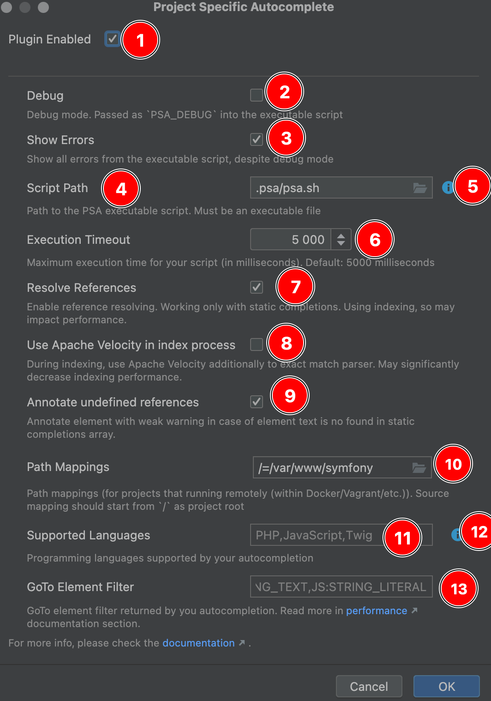
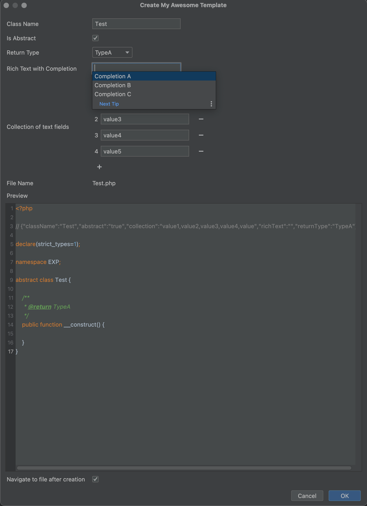

# intellij-psa
##  Intellij Project-Specific Autocomplete


[](https://plugins.jetbrains.com/plugin/24604)
[](https://plugins.jetbrains.com/plugin/24604)


<!-- Plugin description -->
Small plugin which adds support for custom autocomplete & GoTo on the language you're writing your project.

Currently, supports:
* Custom autocomplete based on your code (Ctrl + Space)
* Custom GoTo based on your code (Ctrl/Command + Click)
* Custom code templates (with variables) based on your code
* Indexing of completions/GoTo to increase performance

### Supported Languages
Any language that your IDE supports will be supported by plugin.

To check how to add custom autocomplete, GoTo and custom code templates, please read 
[documentation](https://github.com/sam0delkin/intellij-psa#documentation) 
<!-- Plugin description end -->


Table of Contents
=================

* [Supported Languages](#supported-languages)
* [Installation](#installation)
* [Idea](#idea)
  * [Introduction](#introduction)
  * [How it works?](#how-it-works)
* [Documentation](#documentation)
  * [Configuration](#configuration)
  * [Custom autocomplete info](#custom-autocomplete-info)
  * [Completions &amp; GoTo](#completions--goto)
    * [Debug](#debug)
      * [Completions](#completions)
      * [GoTo](#goto)
  * [Indexing](#indexing)
    * [Introduction &amp; Internals](#introduction--internals)
    * [Indexing process](#indexing-process)
    * [Batch processing](#batch-processing)
  * [Code Templates](#code-templates)
    * [Single File Template](#single-file-template)
  * [Performance considerations](#performance-considerations)
    * [General](#general)
    * [GoTo optimizations](#goto-optimizations)
  * [StatusBar Icon](#statusbar-icon)
* [Ideas / ToDo](#ideas--todo)
* [FAQ / How To](#faq--how-to)

## Installation

- Using IDE built-in plugin system:
  <kbd>Settings/Preferences</kbd> > <kbd>Plugins</kbd> > <kbd>Marketplace</kbd> > 
  <kbd>Search for "Project Specific Autocomplete"</kbd> > <kbd>Install Plugin</kbd>

- Manually:

  Download the [latest release](https://github.com/sam0delkin/intellij-psa/releases/latest) and install it manually using
  <kbd>Settings/Preferences</kbd> > <kbd>Plugins</kbd> > <kbd>⚙️</kbd> > <kbd>Install plugin from disk...</kbd>


## Idea
### Introduction

Most of scripting languages has own frameworks/CMS (like Symfony, Drupal in PHP, Nest, Next in JS/TS).
And there are some plugins to support some framework/CMS specific features, 
like [symfony plugin](https://plugins.jetbrains.com/plugin/7219-symfony-support)
 or [drupal plugin](https://plugins.jetbrains.com/plugin/7352-drupal). The main problem of
these plugins is that they are not project-specific, and you need to install a lot of plugins
for support different features. And what if you have some custom features in
your own project and want to handle references or autocomplete them?

### How it works?
First of all to use the plugin you should enable it in settings and provide a path to the **executable** script
which will be executed for completions or finding references for GoTo. 

Each time you will try to complete some expression (like ctrl + space) plugin will create a very simple representation
of the currently focused [PSI element](https://plugins.jetbrains.com/docs/intellij/psi-elements.html), JSON encode it,
write to a tmp file (caused by some limitations of arguments/ENV variable length) and pass it into the specified executable.

For example, if you try to autocomplete the following PHP code:
```php
<?php

function myFunc() {
    $l = '';
//        ^   caret is here
}

```
then you'll receive the following JSON in the filepath, passed from `PSA_CONTEXT` ENV variable:
<details>
  <summary>Expand</summary>

```JSON
{
  "elementType": "right single quote",
  "elementName": null,
  "elementFqn": null,
  "text": "'",
  "parent": {
    "elementType": "String",
    "elementName": null,
    "elementFqn": null,
    "text": "''",
    "parent": {
      "elementType": "Assignment expression",
      "elementName": null,
      "elementFqn": null,
      "text": "$l = ''",
      "parent": {
        "elementType": "Statement",
        "elementName": null,
        "elementFqn": null,
        "text": "$l = '';",
        "parent": {
          "elementType": "Group statement",
          "elementName": null,
          "elementFqn": null,
          "text": "{\n    $l = '';\n}",
          "parent": {
            "elementType": "FUNCTION",
            "elementName": null,
            "elementFqn": null,
            "text": "function myFunc() {\n    $l = '';\n}",
            "parent": {
              "elementType": "PsiElement(Non Lazy Group statement)",
              "elementName": null,
              "elementFqn": null,
              "text": "<?php\n\nfunction myFunc() {\n    $l = '';\n}",
              "parent": {
                "elementType": "php.FILE",
                "elementName": null,
                "elementFqn": null,
                "text": "<?php\n\nfunction myFunc() {\n    $l = '';\n}\n",
                "parent": {
                  "elementType": "<null>",
                  "elementName": null,
                  "elementFqn": null,
                  "text": "",
                  "parent": {
                    "elementType": "<null>",
                    "elementName": null,
                    "elementFqn": null,
                    "text": "",
                    "parent": {
                      "elementType": "<null>",
                      "elementName": null,
                      "elementFqn": null,
                      "text": "",
                      "parent": {
                        "elementType": "<null>",
                        "elementName": null,
                        "elementFqn": null,
                        "text": "",
                        "parent": {
                          "elementType": "<null>",
                          "elementName": null,
                          "elementFqn": null,
                          "text": "",
                          "parent": {
                            "elementType": "<null>",
                            "elementName": null,
                            "elementFqn": null,
                            "text": "",
                            "parent": null,
                            "prev": null,
                            "next": null
                          },
                          "prev": {
                            "elementType": "<null>",
                            "elementName": null,
                            "elementFqn": null,
                            "text": "",
                            "parent": null,
                            "prev": null,
                            "next": null
                          },
                          "next": {
                            "elementType": "<null>",
                            "elementName": null,
                            "elementFqn": null,
                            "text": "",
                            "parent": null,
                            "prev": null,
                            "next": null
                          }
                        },
                        "prev": null,
                        "next": {
                          "elementType": "PLAIN_TEXT_FILE",
                          "elementName": null,
                          "elementFqn": null,
                          "text": "",
                          "parent": null,
                          "prev": null,
                          "next": null
                        }
                      },
                      "prev": {
                        "elementType": "<null>",
                        "elementName": null,
                        "elementFqn": null,
                        "text": "",
                        "parent": null,
                        "prev": null,
                        "next": null
                      },
                      "next": {
                        "elementType": "<null>",
                        "elementName": null,
                        "elementFqn": null,
                        "text": "",
                        "parent": null,
                        "prev": null,
                        "next": null
                      }
                    },
                    "prev": {
                      "elementType": "<null>",
                      "elementName": null,
                      "elementFqn": null,
                      "text": "",
                      "parent": null,
                      "prev": null,
                      "next": null
                    },
                    "next": {
                      "elementType": "<null>",
                      "elementName": null,
                      "elementFqn": null,
                      "text": "",
                      "parent": null,
                      "prev": null,
                      "next": null
                    }
                  },
                  "prev": {
                    "elementType": "<null>",
                    "elementName": null,
                    "elementFqn": null,
                    "text": "",
                    "parent": null,
                    "prev": null,
                    "next": null
                  },
                  "next": {
                    "elementType": "<null>",
                    "elementName": null,
                    "elementFqn": null,
                    "text": "",
                    "parent": null,
                    "prev": null,
                    "next": null
                  }
                },
                "prev": null,
                "next": null
              },
              "prev": {
                "elementType": "WHITE_SPACE",
                "elementName": null,
                "elementFqn": null,
                "text": "\n",
                "parent": null,
                "prev": null,
                "next": null
              },
              "next": null
            },
            "prev": null,
            "next": {
              "elementType": "WHITE_SPACE",
              "elementName": null,
              "elementFqn": null,
              "text": "\n\n",
              "parent": null,
              "prev": null,
              "next": null
            }
          },
          "prev": null,
          "next": {
            "elementType": "WHITE_SPACE",
            "elementName": null,
            "elementFqn": null,
            "text": " ",
            "parent": null,
            "prev": null,
            "next": null
          }
        },
        "prev": {
          "elementType": "WHITE_SPACE",
          "elementName": null,
          "elementFqn": null,
          "text": "\n",
          "parent": null,
          "prev": null,
          "next": null
        },
        "next": {
          "elementType": "WHITE_SPACE",
          "elementName": null,
          "elementFqn": null,
          "text": "\n    ",
          "parent": null,
          "prev": null,
          "next": null
        }
      },
      "prev": {
        "elementType": "semicolon",
        "elementName": null,
        "elementFqn": null,
        "text": ";",
        "parent": null,
        "prev": null,
        "next": null
      },
      "next": null
    },
    "prev": null,
    "next": {
      "elementType": "WHITE_SPACE",
      "elementName": null,
      "elementFqn": null,
      "text": " ",
      "parent": null,
      "prev": null,
      "next": null
    }
  },
  "prev": null,
  "next": {
    "elementType": "left single quote",
    "elementName": null,
    "elementFqn": null,
    "text": "'",
    "parent": null,
    "prev": null,
    "next": null
  }
}
```
</details>

> [!NOTE]
> In the output above the `options` and `textRange` options are omitted to make output less size.

## Documentation

### Configuration

1) Is plugin enabled or not.
2) Is debug enabled or not. Passed as `PSA_DEBUG` into the executable script.
3) Path to the PSA executable script. Must be an executable file.
4)  button to update info from your PSA script.
5) Is indexing enabled or not. 
6) Indexing concurrency. Controls number of processes which may be run in parallel during indexing. 
7) Indexing batch count. Controls number of serialized elements which will be sent into PSA script in batch during
indexing process. 
8) Indexing max elment count. Controls how much elements are allowed to be indexed. In case of file contains more
elements than specified in this option, indexing of this file will be ignored. 
9) Process only indexed elements. If checked, PSA will not try to execute script in case of file is already indexed and
completions/GoTo has not found in index. Useful for performance reasons. 
10) Maximum script execution timeout. If script will execute longer that this value, execution will be interrupted. 
11) Path mappings (for projects that running remotely (within Docker/Vagrant/etc.)). Source mapping should start from `/`
as project root. 
12) Programming languages supported by your autocompletion. Separated by comma, read-only.
13)  button to get all the languages supported by your IDE. Comma separated. 
Only one of these languages allowed to be passed in `supported_languages` value. 
14) GoTo element filter returned by you autocompletion. Separated by comma, read-only. Read more in 
[performance](#goto-optimizations) section.

To configure your autocomplete, follow these actions:
1) Check the `Plugin Enabled` checkbox (1) for enable plugin
2) Specify a path to your executable in the `Script Path` field (3)
3) Click the  icon right to the `Script Path` field to retrieve info from your executable
4) After that fields `Supported Languages` (5) and optionally `GoTo Element Filter` (6) will be filled automatically in
case of your script is return data in valid format
5) Save settings

### Custom autocomplete info

When you installed and enabled plugin, and you click the  icon right to the `Script Path` field, IDE will run
your executable script to retrieve supported languages + GoTo element filter (for 
[performance optimizations](#goto-optimizations)). In this case only 2 ENV variables would be passed to your executable:
* `PSA_TYPE` - will be `Info`.
* `PSA_DEBUG` - `1` in case of debug is enabled in plugin settings and `0` otherwise.

As a result, your script should return an array of supported languages:
<details>
  <summary>Expand</summary>

```JSON
{
  "supported_languages": "array of strings. List of supported programming languages.",
  "goto_element_filter": "optional, array of strings. Used for filter element types where GoTo will work. Performance optimization.",
  "templates": [
    {
      "type": "string, required. For now, only `single_file` is supported.",
      "name": "string, required. Name of the template for reference. Will be passed in `PSA_CONTEXT` during template generation.",
      "title": "string, required. Title of the template. This text will be shown in IDE.",
      "path_regex": "string, optional. Regular expression. Used to filer path where this code template is available.",
      "fields": [
        {
          "name": "string, required. Name of the form field. Will be passed in `PSA_CONTEXT` during template generation.",
          "title": "string, required. Title of the field which will be displayed in form.",
          "type": "string, required. Allowed values are `Text`, `Checkbox`, `Select`. Type of the form field.",
          "options": "array of strings. Required only if `type` is `Select`. Array of select options."
        }
      ]
    }
  ],
  "supports_batch": "optional, boolean. Specifies does batch processing is supported by your script. Useful for speed-up indexing."
}
```
</details>

For example, if your script is supporting JavaScript and TypeScript and return GoTo only for JS string literals, you
should return the following JSON:
<details>
  <summary>Expand</summary>

```JSON
{
  "supported_languages": ["JavaScript", "TypeScript"],
  "goto_element_filter": ["JS:STRING_LITERAL"]
}
```
</details>

### Completions & GoTo

As it already mentioned in [introduction](#how-it-works), plugin is sending JSON-encoded PSI tree into the executable.

Here is the full list of ENV variables passed to the executable:
* `PSA_CONTEXT` - file path that contain the JSON-encoded PSI context.
* `PSA_TYPE` - may be either `Completion` or `GoTo`. Type of the execution.
* `PSA_LANGUAGE` - language which is caused the autocomplete/resolving reference (`PHP`, `JS`, ...).
* `PSA_DEBUG` - `1` in case of debug is enabled in plugin settings and `0` otherwise.
* `PSA_OFFSET` - shows cursor position within current element in editor.

So, you can parse the JSON and analyze it for your needs. This JSON has a tree structure, and each element will have
the following structure:

<details>
  <summary>Expand</summary>

```JSON
{
  "elementType": "string",
  "elementName": "string | null",
  "elementFqn": "string | null",
  "options": {
    "optionName": "optionValue"
  },
  "text": "string",
  "parent": "additional tree element",
  "prev": "additional tree element",
  "next": "additional tree element",
  "textRange": {
    "startOffset": "integer, start PSI element position is the file",
    "endOffset": "integer, end PSI element position is the file"
  }
}
```
</details>

By analyzing element and it's parents + some options you may find how to check that the caret is on the element
which may be autocompleted.

As a result your script should return:

* Array of completions in case of `PSA_TYPE` is `Completion`.
* Array of completions with one element (this element should contain a link) in case of `PSA_TYPE` is `GoTo`.
* Optional, you can pass notifications array which will be shown by IDEA. Useful for debug purposes.
* Optional, you can return an array of element types to filter GoTo for performance reasons. For more information, 
please read [performance](#goto-optimizations) section.

Full resulting JSON structure will be described below:

<details>
  <summary>Expand</summary>

```JSON
{
  "completions": [
    {
      "text": "string, the text of completion",
      "link": "string, required only in case of `PSA_TYPE=GoTo`, the absolute/relative link to the file in format FileName.ext[:line_number][:position]",
      "bold": "boolean, should the completion be bold.",
      "priority": "number, optional. Used for ordering elements in the autocomplete. If `bold` is `true` and `priority` is not specified, then default value would be 100.",
      "type": "string, the type which will be shown as grayed text on the right of completion."
    }
  ],
  "notifications": [
    {
      "type": "string, may be either `info`, `error` or `warning`.",
      "text": "string, the text of the notification."
    }
  ]
}
```
</details>

And the full working example:

<details>
  <summary>Expand</summary>

```JSON
{
  "completions": [
    {
      "text": "My Completion",
      "link": "/path/to/file.php:123:123",
      "bold": false,
      "priority": 123,
      "type": "MyType"
    }
  ],
  "notifications": [
    {
      "type": "info",
      "text": "Hello from my custom autocomplete!"
    }
  ]
}
```
</details>

In case of your executable will respond with the JSON above, result completion will look like:


And the following notification will be shown:


For working examples on different languages, check out the [examples](examples) folder.

> [!NOTE]
> In case of `PSA_TYPE` is `GoTo`, you should return only one completion with the link to reference.

#### Debug

It's almost impossible to describe the full structure of `PSA_CONTEXT`, especially all `options` passed to the context,
due to its very dynamic and based on the language you're using. Of course, you can just write JSON into the tmp file
and then analyze it, but it's much easier to use debug on your language. When `Debug` option is set in the plugin
settings, a ENV variable `PSA_DEBUG` will be passed to your script with value `1`. You can use it for debugging. 

You can always execute your script with debug option, but it will slow down the execution during the time you're not 
need to debug autocomplete. For this purpose a `PSA_DEBUG` option is passing to your script. Some examples for 
[PHP](examples/php/psa.sh), [JavaScript](examples/js/psa.sh), [TypeScript](examples/ts/psa.sh) are shown in the 
[examples](examples) folder.

##### Completions

When `Debug` option is set in the plugin settings, and you try to autocomplete something in some supported language,
debug will break on your breakpoint (if specified). So you can debug autocomplete script like you usually debugging your
app (on PHP, JavaScript, TypeScript, etc.). See examples for PHP and JavaScript:

<details>
  <summary>PHP Debug</summary>


</details>

<details>
  <summary>JavaScript Debug</summary>


</details>


##### GoTo

GoTo debugging is working absolutely same as completion debugging, except one thing: when IDE is running completion,
execution may be interrupted (user may click on other element, or press Escape key), and it means that it's ok to run
long command during autocomplete and IDE will not freeze during this execution. But resolving reference can't be
interrupted and executing synchronously, so when you will try to run GoTo with debug enabled, you'll see the following
window:


And when you press `Cancel`, you'll see the following window:


It's ok, and when you'll press `OK`, you will be able to debug your completion and execution will be stopped on 
breakpoint.

> [!NOTE]
> To not overload IDE, plugin automatically check that completion is started in any file within the directory of
> `Script Path` setting and prevent GoTo/Completion from any file of this path. So, debug sessions will not be
> recursively started during your debugging session.

> [!WARNING]
> Keep `Debug` option disabled in plugin settings such as it has a strong impact on performance. Enable debug only in
> case of you want to debug your autocomplete (write new completion, or check why some old is not working).

### Indexing

#### Introduction & Internals
Intellij provides extension points for multiple index types like
example, [FileBasedIndex](https://plugins.jetbrains.com/docs/intellij/file-based-indexes.html), 
[Stub Indexes](https://plugins.jetbrains.com/docs/intellij/stub-indexes.html) but all of them are not fit plugin needs
because of various problems (they are running in [Dumb Mode](https://plugins.jetbrains.com/docs/intellij/indexing-and-psi-stubs.html#dumb-mode), 
which are significantly decrease PsiElement options resolving, or even running on raw AST Tree). The main idea of the
plugin is to provide custom autocomplete & GoTo on the currently opened files. So whe one even need to index the whole
file tree, while we can index only opened files? For these reasons, [Gists](https://plugins.jetbrains.com/docs/intellij/indexing-and-psi-stubs.html#gists)
were chosen as index type for the PSA.

#### Indexing process
When you're opening any project with PSA configured and enabled, plugin getting all the currently opened files and 
indexing them asynchronously in background. This process will be visible on the status bar, and you even can interrupt 
indexing of any file if you want. As well as when you're opening any new file, it will be indexed as well.
Additionally, by Gist indexing nature, any file change will cause reindexing of the whole file.
Old, non-indexed autocomplete & GoTo will still be available and work during indexing.

Such as indexing is a time-consuming process, plugin is doing it asynchronously and in parallel. You can configure
concurrency level in the plugin settings, by default it set to the number of CPU cores in your system.

#### Batch processing
As it already said, indexing is a time-consuming and slow process, so it would be nice to minimize external process
calls. For this purpose a batch processing were introduced. It is working absolutely same as usual Completion or GoTo
request, but `PSA_CONTEXT` is now actually contain an array of contexts: one for each element being indexed.

> [!NOTE]
> You can configure number of elements which will be sent to your PSA script in batch from plugin settings.

To support batch processing your PSA script `Info` result should return an optional config value `supports_batch` and
if it's value is `true`, plugin will use batch processing during indexing.

There are 2 new `PSA_TYPE` values: `BatchGoTo` and `BatchCompletion`. They are working absolutely same, but there is an 
array of contexts will be passed to your script instead of single context, and your script should return an array of
results instead of single one. So, `PSA_CONTEXT` will be:
<details>
  <summary>Expand</summary>

```json
[
  {
    "elementType": "right single quote",
    "elementName": null,
    "elementFqn": null,
    "text": "'",
    "...": "..."
  },
  {
    "elementType": "right single quote",
    "elementName": null,
    "elementFqn": null,
    "text": "'",
    "...": "..."
  }
]
```
</details>

and your script should return values in the following format:
<details>
  <summary>Expand</summary>

```json
[
  {
    "completions": [
      {
        "text": "My Completion For First Element",
        "link": "/path/to/file.php:123:123",
        "bold": false,
        "priority": 123,
        "type": "MyType"
      }
    ],
    "notifications": []
  },
  {
    "completions": [
      {
        "text": "My Completion For Second Element",
        "link": "/path/to/file.php:123:123",
        "bold": false,
        "priority": 123,
        "type": "MyType"
      }
    ],
    "notifications": []
  }
]
```
</details>

### Code Templates

Most of the languages provides some general file templates, like `PHP Class` in PHP or `TypeScript File`
in TypeScript. Plugin allows you to create custom file templates which will have variables passed from form.
For support of file templates you must specify all supported templates in your executable script in
`templates` section. Check out [autocomplete info](#custom-autocomplete-info) section for more info.

#### Single File Template

In case of you need to create a single file template, in info request your JSON should contain template with the
following fields:
- `type` - string, required. For now, only `single_file` is supported.
- `name` - string, required. Name of the template for reference. Will be passed in `PSA_CONTEXT` during template generation.
- `title` - "string, required. Title of the template. This text will be shown in IDE.
- `path_regex` - string, optional. Regula
- `fields` - array of objects with the following structure:
  - `name` - string, required. Name of the form field. Will be passed in `PSA_CONTEXT` during template generation.
  - `title` - string, required. Title of the field which will be displayed in form.
  - `type` - string, required. Allowed values are `Text`, `Checkbox`, `Select`, `Collection`, `RichText`. Type of the form field.
  - `options` - array of strings.
    - Required if `type` is `Select`. Array of select options.
    - Required if `type` is `RichText`. Array of completions.

For example, for some simple PHP Class you can use the following structure:
<details>
  <summary>Expand</summary>

```JSON
{
  "templates": [
    {
      "type": "single_file",
      "name": "my_awesome_template",
      "title": "My Awesome Template",
      "path_regex": "^\/src\/[^\/]\/$",
      "fields": [
        {
          "name": "className",
          "title": "Class Name",
          "type": "Text",
          "options": []
        },
        {
          "name": "abstract",
          "title": "Is Abstract",
          "type": "Checkbox",
          "options": []
        },
        {
          "name": "comment",
          "title": "Comment",
          "type": "Select",
          "options": ["Option A", "Option B", "Option C"]
        },
        {
          "name": "richText",
          "title": "Rich Text with Completion",
          "type": "RichText",
          "options": ["Completion A", "Completion B", "Completion C"]
        },
        {
          "name": "collection",
          "title": "Collection of text fields",
          "type": "Collection",
          "options": []
        }
      ]
    }
  ]
}
```
</details>

And in case of your autocomplete script will return template like above, you will have the following menu option to
generate a new file from template on any path in project structure (path may be filtered by `path_regex` option):
<details>
  <summary>Expand</summary>


</details>

When You click on the action, you'll see the following form:
<details>
  <summary>Expand</summary>


</details>

On this form you can modify any of your variables described above. Preview is updated automatically after you change
the value of any variable.

After clicking `OK` button, the file will be generated in the folder where you initialed the action.

After opening the form, after changing any of the variable and on clicking OK, plugin will send a request for code
generation to your autocomplete script with the following variables:

- `PSA_TYPE` - will be always `GenerateFileFromTemplate`
- `PSA_CONTEXT` - like with completion, it's a path to file with JSON of following structure:
  ```JSON
  {
    "templateName": "string, name of the template for generate.",
    "actionPath": "string, relative path from project root when the action were initiated.",
    "formFields": {
      "name": "value"
    },
    "originatorFieldName": "string, optional. If template regeneration were cause by some field change, this option will contain this field name."
  }
  ```
> [!NOTE]
> `formFields` - will be a JSON object where each key is a field name, and value will be a value of the form field.

As a result, your script should return a simple JSON object with the following fields:
```JSON
{
  "file_name": "string, required. Filename of the newly generated file.",
  "content": "string, required. Content of the file.",
  "form_fields": {
    "{field_name}": {
      "options": "Array of strings, optional. Here you can override array of `RichText` completions.",
      "value": "String, optional. Here you can override current value of any form field if needed."
    }
  }
}
```
> [!NOTE]
> `form_fields` - is a optional field. Each inner value of `form_fields` is optional as well.

Some examples for [PHP](examples/php/psa.php), [JavaScript](examples/js/psa.js), [TypeScript](examples/ts/psa.ts) 
are shown in the [examples](examples/README.md) folder.

### Performance considerations

#### General

Calling external program/API is not fast by nature. Things are making worse in case of
program is need to do some long computations (like compiling TypeScript, or building some cache (like Symfony does)).

So, keep it in mind and make some long computations as the last part of your code. For example, if
you need to autocomplete Symfony services, boot Symfony kernel only in case of you sure that
completions may be applied in the current context.
<details>
  <summary>Expand</summary>

Do:
```php
<?php

$context = json_decode(file_get_contents(getenv('PSA_CONTEXT')), true);

if (!checkElement($context)) {
  echo json_encode(['completions' => [], 'notifications' => []]);

  die;
}

$kernel = bootKernel();
```
instead of:
```php
<?php

$context = json_decode(file_get_contents(getenv('PSA_CONTEXT')), true);
$kernel = bootKernel();

if (!checkElement($context)) {
  echo json_encode(['completions' => [], 'notifications' => []]);

  die;
}
```
</details>

#### GoTo optimizations

When you're clicking (Ctrl/Command + Click) by **any** element in the IDE editor, IDE is calling all GoTo
contributors, regardless of language or any other things. And there is no way to know - does your custom autocomplete
will resolve the reference or not. So plugin will still try to call your script to check that element may be resolved, 
and GoTO reference provided. This will lead to freezes in IDE UI when you're trying to GoTo in some place which 
your custom autocomplete is not support. TO overcome this problem, there is an additional option were added:
`goto_element_filter`. Here your script should return an array of element types to filter GoTo references. It will be 
saved first time your script will be called with [Info](#custom-autocomplete-info) call and then will ignore all 
elements that are not matching the types provided.

### StatusBar Icon
Plugin provides a status bar icon which is showing current status of autocomplete. Icon is showing only in case of 
plugin is enabled in settings. Also, if you want, you can hide it by right-click on the status bar.
Icon is showing either green  or 
red  dot on the left top corner, showing the result of
last PSA operation. If result wee succeed, icon will be green and red otherwise.

Also, if you click on the icon, a quick plugin actions menu will be show:


where you can see plugin actions menu.

## Ideas / ToDo

- [x] Add support of autocomplete
- [x] Add support of GoTo
- [x] Add support of single-file custom code templates with variables
- [ ] Add support of multi-file custom code templates with variables
- [ ] Add support of intentions

## FAQ / How To

**Q: What if I run my project in Docker?**

**A:** It's no problem. You can easily use it with the plugin. See examples for 
[docker-compose](examples/docker-compose) or [docker](examples/docker).

**Q: What about some API projects, like Nest/Next, which are starting slow?**

**A:** Yeah, it's problem for Nest/Next to compile each time you're trying to autocomplete the code. But there is a 
solution: you can implement some route, which will be accessible in DEV environment only, and respond with completions.
See [example](examples/api).

**Q: What if I want to use some feature that is not yet supported?**

**A:** Please, create an [issue](https://github.com/sam0delkin/intellij-psa/issues/new) for that. Describe the problem 
very thoroughly.

**Q: What if I want to implement some feature that is not yet supported?**

**A:** That's really great 😊. Please, [fork](https://github.com/sam0delkin/intellij-psa/fork) the repository and then
create a [pull request](https://github.com/sam0delkin/intellij-psa/compare).

---
Plugin based on the [IntelliJ Platform Plugin Template][template].

[template]: https://github.com/JetBrains/intellij-platform-plugin-template
[docs:plugin-description]: https://plugins.jetbrains.com/docs/intellij/plugin-user-experience.html#plugin-description-and-presentation
